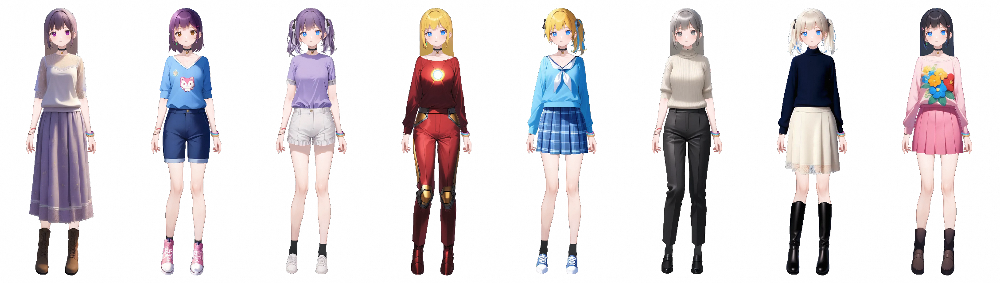
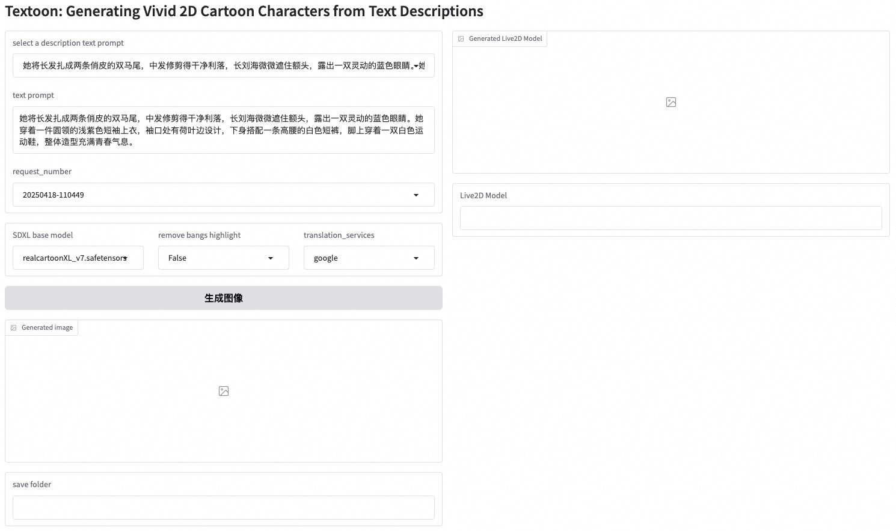
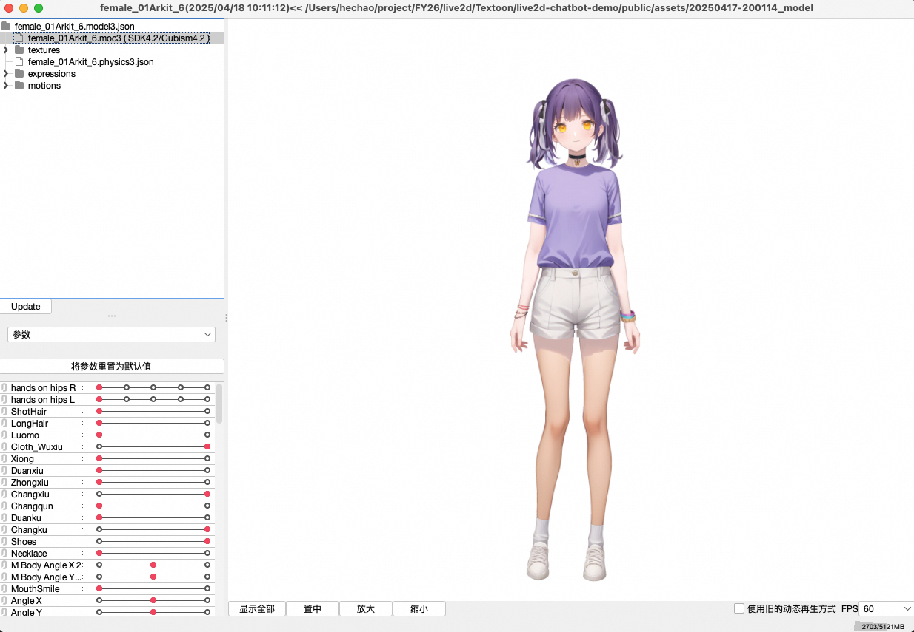
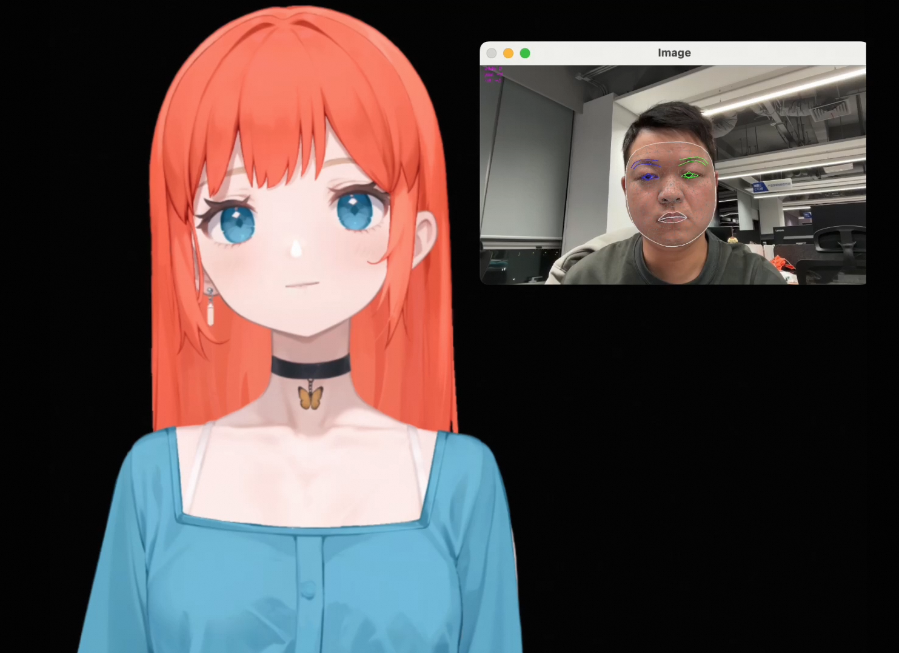

# Textoon: Generating Vivid 2D Cartoon Characters from Text Descriptions</span>


<div align="center">

[](https://human3daigc.github.io/Textoon_webpage/)
[](https://arxiv.org/pdf/2501.10020)
[](https://www.apache.org/licenses/LICENSE-2.0)

</div>

<p align="center">
  
</p>

<p align="center">
[](https://www.youtube.com/watch?v=cA0yNZwyGTo "Textoon")
</p>

[If the video cannot be displayed, please visit YouTube directly to watch it](https://youtu.be/cA0yNZwyGTo)

## 😊Getting Started

### 1️⃣step1. ComfyUI
1. Install [ComfyUI](https://github.com/comfyanonymous/ComfyUI):commit_id=82c53085616252e483a78abceac3b7e23495e019; <br>
```
conda create -n comfyui python=3.10
```
2. Download SDXL model [realcartoonXL_v7.safetensors](https://civitai.com/models/125907/realcartoon-xl) and [sdxl-动漫二次元_2.0.safetensors](https://www.liblib.art/modelinfo/84dbce56477243dd9f9800420f73d256?versionUuid=f0a58eac5b644453bd9172c5e118cea6) in 'models/checkpoints', sdxl_img2img_inpainting_api.json uses 'sdxl-动漫二次元_2.0.safetensors' by default; <br>
3. Download SDXL ControlNet model [xinsir_controlnet_union_sdxl_promax.safetensors](https://huggingface.co/xinsir/controlnet-union-sdxl-1.0), rename as 'xinsir_controlnet_union_sdxl_promax.safetensors' in 'models/controlnet'; <br>
4. Install the missing custom nodes to 'custom_nodes' ensure that the workflow can be fully run, If requirements.txt exists on each node, it needs to be installed;
  - [ComfyUI-Advanced-ControlNet](https://github.com/Kosinkadink/ComfyUI-Advanced-ControlNet):commit_id=172543b7252db3f15d9bebfa763abb59769624e5
  - [comfyui-tooling-nodes](https://github.com/Acly/comfyui-tooling-nodes):commit_id=50c3ffdf649bd55a0b985d775e79cfe62bae1379
  - [Comfyui_CXH_joy_caption](https://github.com/StartHua/Comfyui_CXH_joy_caption):commit_id=894b66159ddc0cd146dc913d27ee6c82ace80491
  - [ComfyUI_essentials](https://github.com/cubiq/ComfyUI_essentials):commit_id=64e38fd0f3b2e925573684f4a43727be80dc7d5b
  - [comfyui-art-venture](https://github.com/sipherxyz/comfyui-art-venture):commit_id=50abaace756b96f5f5dc2c9d72826ef371afd45e
  - [ComfyUI_Custom_Nodes_AlekPet](https://github.com/AlekPet/ComfyUI_Custom_Nodes_AlekPet):commit_id=7b3d6f190aeca261422bdfb74b5af37937e5bf68
  - [comfyui_controlnet_aux](https://github.com/Fannovel16/comfyui_controlnet_aux):commit_id=5a049bde9cc117dafc327cded156459289097ea1
  - [comfyui-mixlab-nodes](https://github.com/shadowcz007/comfyui-mixlab-nodes):commit_id=868c6085a8dcb9bdb2dc6d171d471abfafcc2794
```
cd ComfyUI
python main.py --listen
```
5. Record the IP and port of the ComfyUI service and fill it into assets/model_configuration.json "comfyui_ip_port".
### 2️⃣step2. Run

<p align="center">
  
</p>

1. Install Conda environment;

```
conda create -n textoon python=3.11
conda activate textoon

pip install torch==2.5.0 torchvision==0.20.0 torchaudio==2.5.0 --index-url https://download.pytorch.org/whl/cu121
# if CPU Only
pip install torch==2.5.0 torchvision==0.20.0 torchaudio==2.5.0 --index-url https://download.pytorch.org/whl/cpu

pip install -r requirements.txt
```

2. Configure the translation service. If you can access Google, set ‘translation_services’ to ‘google’. Otherwise, it is recommended to use [Alibaba Cloud Translation Service](https://www.aliyun.com/product/ai/base_alimt). Activate the service to obtain AK&SK and fill in the environment variables Translate_AK&Translate_SK;
3. Download text parsing model(Based on Qwen2.5) and place it in the model folder;
4. Run the main.py;
```
python main.py --text_prompt "她将长发扎成两条俏皮的双马尾，中发修剪得干净利落，长刘海微微遮住额头，露出一双灵动的蓝色眼睛。她穿着一件圆领的浅紫色短袖上衣，袖口处有荷叶边设计，下身搭配一条高腰的白色短裤，脚上穿着一双白色运动鞋"
```
5. The generated Live2D model will be saved in the output folder, and you can preview it in the [Live2D viewer](https://www.live2d.com/en/cubism/download/editor/);
<p align="center">
  
</p>

6. We also provide a gradio page for easy use. If the textoon service and ComfyUI service are on the same machine, you can enter the ComnfyUI checkpoints path to retrieve and change different base models;
```
python app/gradio_demo.py
```
### 3️⃣step3. Drive & Render
<p align="center">
  
</p>

1. Install nodejs and npm;
2. Move generated Live2D model to live2d-chatbot-demo/public/assets/;
3. Modify the model path;
```
const cubism4Model_gen ="assets/20250417-200114_model/female_01Arkit_6.model3.json";
fetch('assets/20250417-200114_model/config.json')
```
4. Start Live2D web rendering;
```
cd live2d-chatbot-demo
sh scripts/run_live2d.sh
```
5. Use mediapipe to drive live2d models in real time.
```
python scripts/mediapipe_live2d.py
```
## Acknowledgement
Many thanks to the following for their great work:

* [ComfyUI](https://github.com/comfyanonymous/ComfyUI)
* [SDXL](https://arxiv.org/pdf/2307.01952)
* [ControlNet](https://github.com/lllyasviel/ControlNet)
* [Qwen2.5](https://github.com/QwenLM/Qwen2.5)
* [Live2D](https://www.live2d.com/en/)
* [mediapipe](https://github.com/google-ai-edge/mediapipe)
* [live2d-chat-demo](https://github.com/nladuo/live2d-chatbot-demo)

## Citation 
```
@article{he2025textoon,
  title={Textoon: Generating Vivid 2D Cartoon Characters from Text Descriptions},
  author={Chao He and Jianqiang Ren and Yuan Dong and Jianjing Xiang and Xiejie Shen and Weihao Yuan and Liefeng Bo},
  journal={arXiv preprint arXiv:2501.10020},
  year={2025}
}
```
